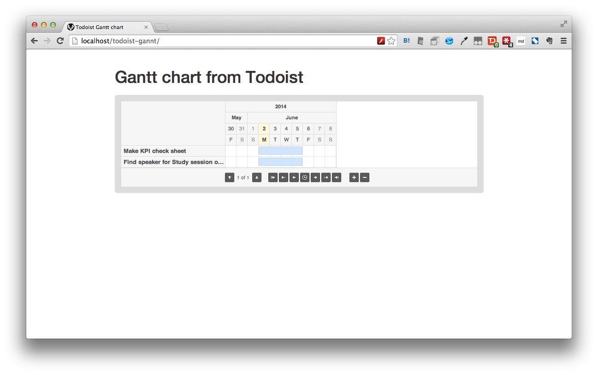

# TodoistGanttChartView

Gantt Chart Viewer for Todoist.

[Todoist](https://todoist.com/)

## Screenshot image



## Demo

Todoist doesn't accept JSONP access anymore. So I deploy a little server side script that access to the Todoist instead of your browser.

[https://todoistgantt.herokuapp.com/](https://todoistgantt.herokuapp.com/)

*You need a Todoist's auth token.*

**We don't save your auth token. But if you care about it, you can deploy your own TodoistGanttChartView on Heroku or your local computer.**

## Deploy

You need a node.js.

```
$ git clone git@github.com:moongift/TodoistGanttChartView.git
$ cd TodoistGanttChartView
$ npm install
$ node_modules/coffee-script/bin/coffee server.coffee
```

## Usage

- Copy auth token from account setting page and paste.
- Load projects
- Choose project
- Show tasks
- Done!

## Notice

If you want to change start date, change your task name format below.

"Task name" to "Task name(YYYY-MM-DD)".

Ex)

Create slide(2014-06-08)

## LICENSE

MIT LICENSE